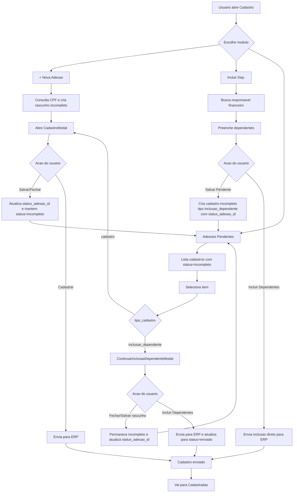

# Fluxo Ponta a Ponta - Cadastro no Venda+

## Objetivo
Documentar o fluxo completo dos modulos:
- `Cadastro > + Nova Adesao`
- `Cadastro > Incluir Dep.`
- `Cadastro > Adesoes Pendentes`

Baseado no comportamento atual do sistema (frontend + regras de envio para ERP).

## Entrada do modulo
Tela principal: `src/pages/Cadastro.tsx`

Abas relevantes:
- `novo` -> `+ Nova Adesao`
- `dependente` -> `Incluir Dep.`
- `incompletos` -> `Adesoes Pendentes`

## Visao integrada (fim a fim)

## Fluxo 1 - `Cadastro > + Nova Adesao`
Componente principal: `src/components/cadastro/NovoCadastroCard.tsx`

1. Usuario seleciona empresa.
2. Usuario informa CPF e clica em `Consultar`.
3. Sistema valida CPF e vendedor (quando obrigatorio por perfil).
4. Sistema verifica duplicidade local (`check_cpf_existente`) e pode abrir `CadastroExistenteModal`.
5. Sistema consulta `erp-check-associado` para bloquear CPF ja ativo no ERP quando aplicavel.
6. Sistema consulta Lemmit (quando habilitado e com saldo), preenche dados e registra consumo.
7. Sistema enriquece endereco via CEP (`erp-endereco-cep`) quando houver CEP.
8. Sistema cria/atualiza rascunho via `createOrUpdateRascunho` com:
   - `status = incompleto`
   - `tipo_cadastro = cadastro`
   - titular criado no array `dependentes`
9. Sistema abre `CadastroModal` para complemento e finalizacao.

### Saidas possiveis
- `Salvar/Fechar` no modal: cadastro continua `incompleto` e exige selecao de `status_adesao_id`.
- `Cadastrar`: envia para ERP (`erp-novo-usuario2`), sincroniza `status = enviado`, e move para lista de cadastradas.

## Fluxo 2 - `Cadastro > Incluir Dep.`
Componente principal: `src/components/cadastro/InclusaoDependenteModal.tsx`

1. Usuario escolhe vendedor (e adesionista, quando aplicavel).
2. Busca responsavel financeiro por codigo ou CPF (`erp-check-associado`).
3. Sistema carrega empresa/planos vinculados ao responsavel (`erp-search-empresa`).
4. Usuario adiciona dependentes e salva cada um.
5. Validacoes por dependente:
   - nome obrigatorio
   - data nascimento obrigatoria
   - CPF obrigatorio para maior de 18
   - sexo, parentesco, plano e nome da mae obrigatorios
6. Usuario vai para etapa de anexos e envia arquivos para bucket temporario.

### Saida A - `Salvar Pendente`
7. Sistema abre modal obrigatorio de status (`SelectStatusModal`).
8. Usuario seleciona `status_adesao_id`.
9. Sistema cria registro em `cadastros` com:
   - `status = incompleto`
   - `tipo_cadastro = inclusao_dependente`
   - dados do responsavel + dependentes + arquivos
10. Registro passa a aparecer em `Adesoes Pendentes`.

### Saida B - `Incluir Dependentes`
7. Sistema monta payload e envia para `erp-novo-dependente`.
8. Para cada anexo, tenta envio direto por `erp-upload-documento`.
9. Se upload falhar, enfileira em `erp-enqueue-upload`.
10. Fluxo conclui no ERP sem criar pendencia operacional nova.

## Fluxo 3 - `Cadastro > Adesoes Pendentes`
Lista principal: `src/components/cadastro/CadastrosIncompletosList.tsx`

1. Tela lista todos os registros com `status = incompleto`.
2. Usuario filtra por associado/empresa, periodo, tipo, status e vendedor.
3. Usuario pode atualizar `status_adesao_id` direto na listagem.
4. Ao abrir item:
   - `tipo_cadastro = cadastro` -> abre `CadastroModal`
   - `tipo_cadastro = inclusao_dependente` -> abre `ContinuarInclusaoDependenteModal`

### 3.1 Pendente do tipo `cadastro` (`CadastroModal`)
- Permite editar dados, contatos, endereco, empresa, dependentes e anexo.
- `Salvar`/`Fechar` abre selecao obrigatoria de status de adesao.
- `Cadastrar` envia para ERP (`erp-novo-usuario2`), tenta upload de documento e fallback por fila.
- Sucesso final: `status = enviado`.

### 3.2 Pendente do tipo `inclusao_dependente` (`ContinuarInclusaoDependenteModal`)
- Permite continuar edicao de dependentes, vendedor/adesionista e empresa.
- Mantem rascunho local e progresso no banco.
- Ao fechar, exige selecao de `status_adesao_id`.
- Ao enviar, chama `erp-novo-dependente`, processa anexos e atualiza:
  - `status = enviado`
  - `tipo_cadastro = inclusao_dependente`

## Regras de status e transicao
- `incompleto`: aparece em `Adesoes Pendentes`.
- `enviado`: sai de pendentes e aparece em `Cadastradas`.
- `status_adesao_id`: classificacao operacional obrigatoria quando o cadastro permanece pendente.

## Endpoints/servicos usados no fluxo
- `check_cpf_existente` (RPC)
- `erp-check-associado`
- `lemit-consulta-pessoa`
- `erp-endereco-cep`
- `erp-search-empresa`
- `erp-novo-usuario2`
- `erp-novo-dependente`
- `erp-upload-documento`
- `erp-enqueue-upload`
- `get_cadastros_stats` (RPC)

## Resultado esperado por modulo
- `+ Nova Adesao`: inicia e finaliza novas adesoes de titular/dependentes.
- `Incluir Dep.`: inclui dependentes direto no ERP ou registra pendencia com status.
- `Adesoes Pendentes`: centraliza tratativa de tudo que ficou `incompleto` ate envio final.
